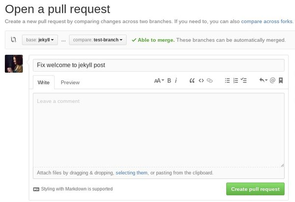
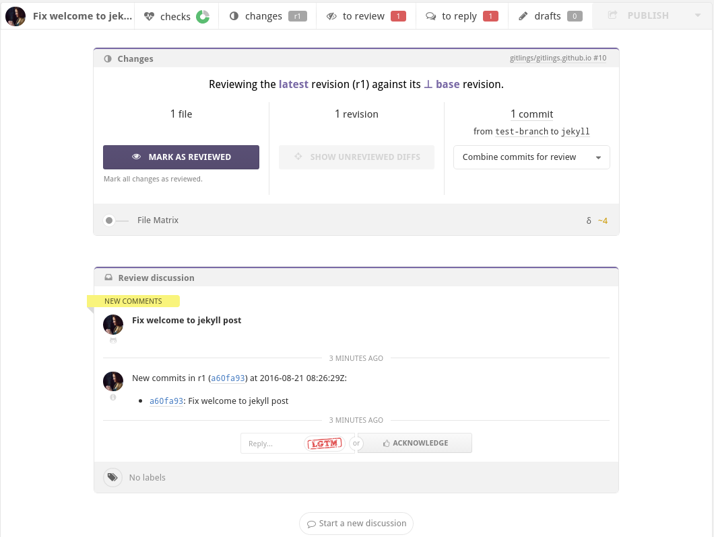
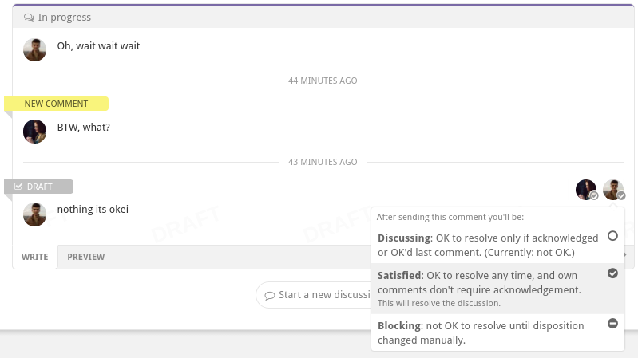

In this post I'll tell you about how to use git and github service in our workflow. I'll cover such topics as managing a git repository locally, synchronizing your work with github, making pull requests, doing code review so contributing to our projects.

<!--more-->

## If you're a beginner in git
If you have no experience in working with git, I highly recommend you to complete the following tutorials:

* [try.github.io][try-github]
* [learngitbranching.js.org][git-branching]

The first one will teach you git basics and the second one will help you to learn how to work with branches. This is really fundamental knowledge, without it you will unlikely be able to work on our projects.

## Working with git locally
So you've cloned a repository, and you're going to do something very useful for your project, to change some files, yeah... So here comes

{: .center }

(Ray Amsley's) **rule number 1**. Do your work in a separate branch.\\
Our repositories are configured the way that you won't be able to commit something to `master`. Even if we missed something, or for any reason you are able to do it, don't. Every single feature, part of work has to be done in a separate branch, that will be merged into `master` via pull request. After pull request is merged, delete your local branch and close its origin on github.

This workflow helps very much in keeping projects clean and organized, also preventing hardly resolvable code conflicts to appear.

**Rule number 1.** [Keep your commits atomic][atomic-commits].

**Rule number 1.** Don't ever ever change history of pushed commits.\\
Never use `push --force`. For the commits which are on github already don't use such commands as `rebase`, `commit --amend`, `reset` (though resetting is okay while not moving HEAD), instead use `revert` for removing all the changes done with specific commit or simply add new commits (technically `revert` does the same). But it's okay to use the first three commands on your commits that are not pushed to public.

If you don't follow the rule and `push --force` modified commits rewriting original ones, you'll create a lot of problems for people who have been working on the branch too. If their work is based on original commits, it'll be tricky and problematic to synchronise.

## Pull requests
So you think you've done you work, you're going to create a pull request to merge it into master. I dare you. ;) Alright, actually it is very good, every contribution is really appreciated. "I'm super serial right now."

So the first step is to go to github and open your repository page. Under the main tab there is "New pull request" button.

{: .center }

So as you can see on this screenshot, we use base branch (the branch we're merging our new changes into) as `jekyll` and compare branch (the branch with new commits) as `test-branch`.

As you create a pull request, reload the page, here you'll see purple "Reviewable" button will have appeared. There are also some checks at the bottom. Pull request can not be accepted and merged until all the checks are completed.

{: .center }

## Reviewable
Essential part of merging pull request is doing code review. Code reviews help to verify done work by each member of team individually, what significantly lowers the chance that some bad or bugged code will appear in master. Also it is a very good way to share your knowledge with other teammates, telling them about best practices that can be applied at the current moment.

Here is a page of typical new pull request in Reviewable:

{: .center }

Every pull request should be reviewed by each member of team and has to be approved by administration. There is "Mark as reviewed" button for it.

Also, if there is any disputable code, a discussion can be started. It's not possible to merge a pull request until all discussions are resolved.
 
{: .center }

After any action in Reviewable (marking as reviewed, writing a comment and so on) don't forget to press "Publish" button, otherwise it won't be applied.

{: .center }

## Merging pull requests
So finally our pull request is reviewed! So now we can merge it, a project collaborator with write access to the repository can do it. After merging a pull request, don't forget to delete your working branch both locally and on github. Even if your next working branch is going to be with the same name, remove it all the same. It will help to keep network graph clean.

Thanks for reading and your patience! This knowledge is really important for team working. Feel free to comment and suggest anything to add, you're welcome!

[try-github]: https://try.github.io/
[git-branching]: http://learngitbranching.js.org/
[atomic-commits]: https://seesparkbox.com/foundry/atomic_commits_with_git
